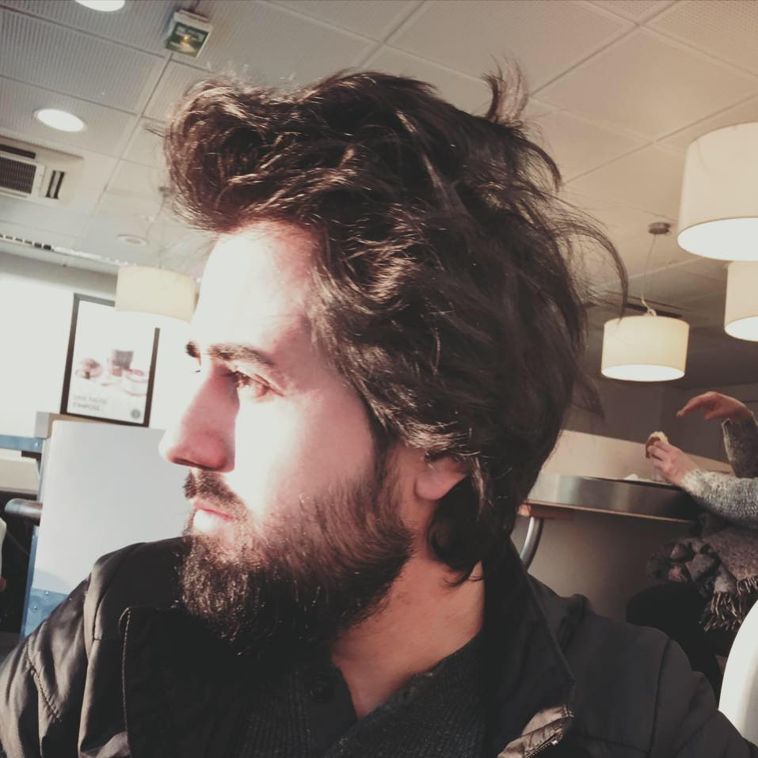

## About Me

Hi! I am **Burak Sahin**, a Ph.D. Candidate in Computer Science at the [Georgia Institute of Technology](https://www.gatech.edu/), advised by [Saman Zonouz](https://sites.google.com/site/samanzonouz4n6/saman-zonouz) ([CPSec Lab](https://sites.gatech.edu/capcpsec/)) and co-advised by [Brendan Saltaformaggio](https://saltaformaggio.ece.gatech.edu/) ([CyFI Lab](https://cyfi.ece.gatech.edu/)).

I hold an M.S. in Computer Science from Georgia Tech (2017) and a B.S. in Computer Science from TOBB University of Economics and Technology (Ankara, Turkey).

## Research Interests

Critical infrastructure is foundational to national security and public safety, yet the underlying control systems remain high-value targets for sophisticated adversaries. My research aims to strengthen the security and resilience of these cyber-physical systems through practical methods for vulnerability discovery, forensic investigation, and malware analysis. I specialize in applying security testing techniques, including **fuzzing** and **symbolic execution**, to identify flaws and investigate failures across industrial and emerging autonomous systems.

## News

* **Mar 2026** — *ICSFlux* accepted to **IEEE S&P 2026**.
* **Dec 2025** — *FIRA* accepted to **USENIX Security 2026**.
* **2025** — Two papers accepted to **CCS 2025** and **NDSS 2025** on cybersecurity regulations and suspicious-login UX.

## Selected Publications

For the full list, see the [Publications](publications) page or my [CV](resume.pdf).

**Fuzzing the Physical Space: Physics-Aware Testing of Black-Box Industrial Control Systems.** <u>Burak Sahin</u>, David Oygenblik, Mingxuan Yao, Yizhi Huang, Brendan Saltaformaggio, Saman Zonouz. *IEEE S&P*, 2026.

**The Challenges and Opportunities with Cybersecurity Regulations: A Case Study of the US Electric Power Sector.** Sena Sahin, <u>Burak Sahin</u>, Robin Berthier, Kate Davis, Saman Zonouz, Frank Li. *ACM CCS*, 2025.

**Was This You? Investigating the Design Considerations for Suspicious Login Notifications.** Sena Sahin, <u>Burak Sahin</u>, Frank Li. *NDSS*, 2025.

**Your Control Host Intrusion Left Some Physical Breadcrumbs: Physical Evidence-Guided Post-Mortem Triage of SCADA Attacks.** Moses Ike, Keaton Sadoski, Romuald Valme, <u>Burak Sahin</u>, Saman Zonouz, Wenke Lee. *AsiaCCS*, 2025.

**Identifying Behavior Dispatchers for Malware Analysis.** Kyuhong Park, <u>Burak Sahin</u>, Yongheng Chen, Jisheng Zhao, Evan Downing, Hong Hu, Wenke Lee. *AsiaCCS*, 2021.

**Complexity Verification Using Guided Theorem Enumeration.** Akhilash Srikanth, <u>Burak Sahin</u>, William R. Harris. *POPL*, 2017.

## Honors & Awards

* Professional Activities Grant, ACM SIGPLAN (POPL '17) — 2017
* Featured in the School of Computer Science Annual Report, Georgia Tech — 2016
* Graduate Program Merit Scholarship, Republic of Turkey — 2014
* Best Intern Award (Excellence in Coop Education), TOBB University — 2007
* Undergraduate Program Merit Scholarship, TOBB University — 2004
